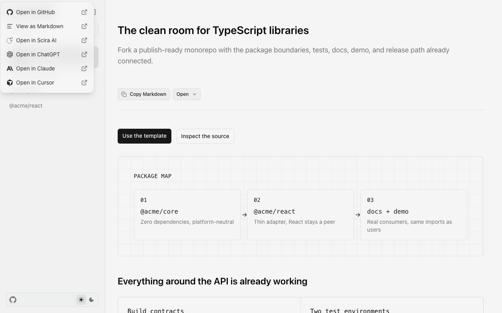
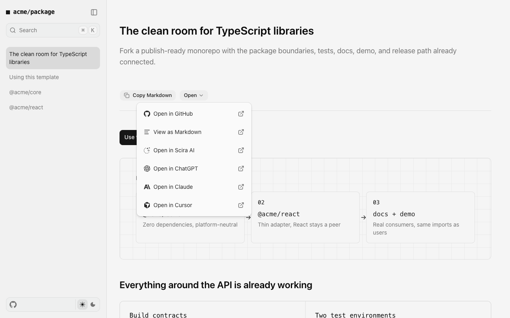
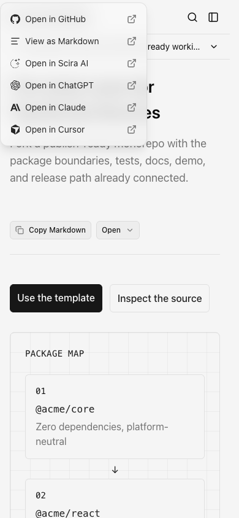
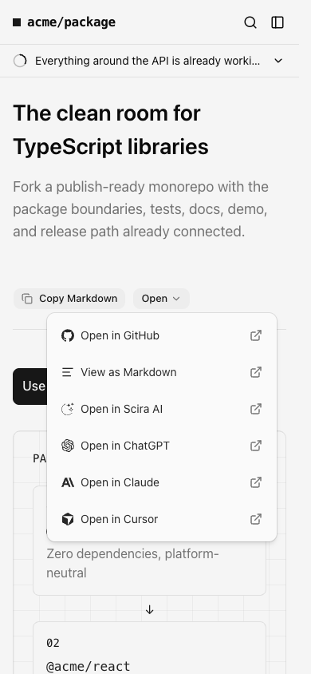

# shadcn visual comparison

Before: `5ec1b5f4b448d2895b955ceb0c37b824384d2181` (PR merge base).

After UI source: `b6de41fa41330c223e41fdbc07b1450bc988e24a`. Later commits in this PR only add review evidence.

The Open popover moves from the viewport corner to its trigger, with stock width and item spacing. Copy/Open controls become more compact; documentation typography and branding remain intact.

Manually compared matching desktop (1280×800) and mobile (390×844) viewports in Chromium, light theme, reduced motion. No horizontal overflow or unexpected clipping was observed in the sampled after states. This covers the pages/states below, not every screen, authenticated flow, or dark-mode state.

Local dev logs contain an existing nested-paragraph hydration warning on both the base and after versions; it is not introduced by this PR.

## Introduction, Open popover expanded

App: `docs`. Route: `/`. Same route and state on both commits.

Desktop

| Before                                     | After                                    |
| ------------------------------------------ | ---------------------------------------- |
|  |  |

Mobile

| Before                                    | After                                   |
| ----------------------------------------- | --------------------------------------- |
|  |  |
